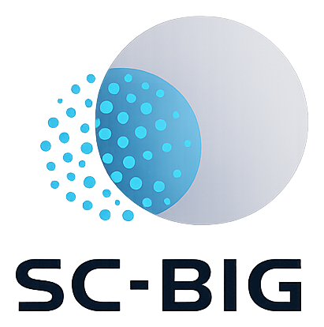

# Bayesian scDNA SNV Caller



SC-BIG is a Bayesian model for somatic SNV calling in single-cell DNA sequencing that uses
bulk sequencing data as a prior.

## Installation

```bash
pip install -e .
```

## Usage

### Command-line Interface

After installation, the `sc-big` command is available. It can be used to create synthetic
data, perform inference, and plot results.

```bash
# Simulate 50 single cells with custom parameters, exporting to JSON.
sc-big simulate -n 50 --ccf 0.3 --purity 0.7 -o simulation.json -v

# See all available options.
sc-big simulate --help
sc-big infer --help
sc-big infer-prosolo --help
sc-big compare --help
```


## Tests

Run the test suite using `pytest`:

```bash
pytest tests/ -v
```

## Documentation

See <biorxiv-paper-link> for background information on the model and its implementation.

## License
The SC-BIG logo was created using the large language model ChatGPT.
All code in this repository is licensed under the GPL-v3 as indicated in the source files.
Please direct requests to daniel.schuette@iccb-cologne.org.
